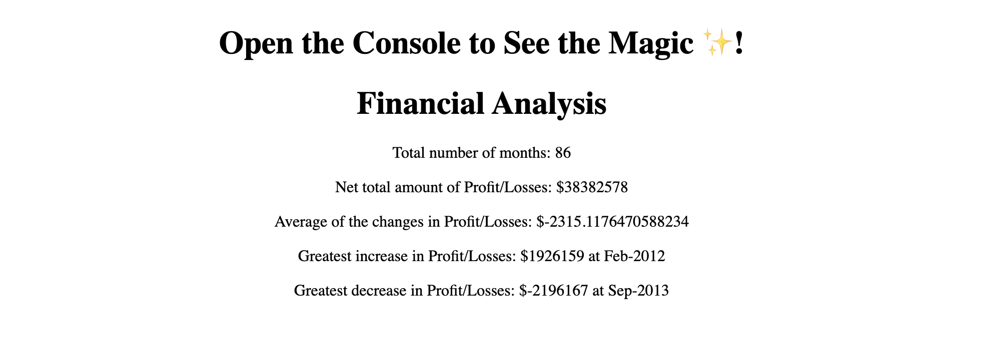
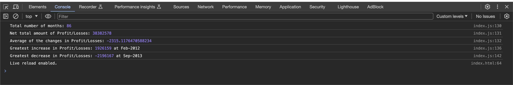

# Console-Finances

Javascript Challenges

The code challenge involves analyzing financial records provided in a dataset. The dataset consists of monthly records spanning several years, with each record containing the month and the corresponding profit or loss amount.

The task is to write JavaScript code to perform the following analyses:

1.Calculate the total number of months included in the dataset.
2.Determine the net total amount of profit/losses over the entire period.
3.Calculate the average of the changes in profit/losses over the entire period.
4.Identify the greatest increase in profit/losses, including the date and the difference in the amounts, over the entire period.
5.Identify the greatest decrease in profit/losses, including the date and the difference in the amounts, over the entire period.

To accomplish this task, the code iterates through the provided dataset, performing calculations and keeping track of necessary information such as total months, net profit/loss, average change, greatest increase, and greatest decrease. Finally, the code presents the analysis results, which can be displayed either in the browser console and in an HTML page.

Screenshots :

Link to deployed application :
https://parthparmar24.github.io/Console-Finances/
